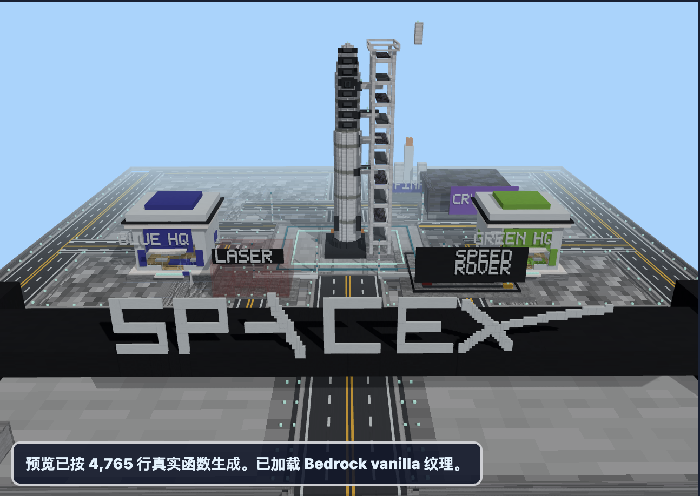

# Minecraft Bedrock Map Generator (.mcpack + 3D Preview)

A TypeScript Minecraft Bedrock map generator and `.mcpack` behavior-pack exporter with a browser 3D voxel preview. It includes a kid-friendly rocket theme park example, generated from real Bedrock `/fill`, `/setblock`, and `/function` commands.

The project is designed for iterative Minecraft map making: adjust the generated blueprint, inspect the browser preview, then export an importable Bedrock `.mcpack` only when the build is worth testing inside Minecraft.



## Features

- Generates a large Minecraft Bedrock map from real `/fill`, `/setblock`, and `/function` commands.
- Renders the generated command output in a local browser preview before importing into Minecraft.
- Exports a Bedrock `.mcpack` behavior pack with `/function build`, `/function start`, `/function rescue`, and `/function clear`.
- Includes a space-launch entrance, vehicle-scale road grid, rocket plaza, launch tower, team HQ buildings, laser maze, rover speedway, and crystal area.
- Keeps generated files out of git: `.mcpack` packages, build output, debug screenshots, and local Minecraft assets are intentionally ignored.

## Good For

- Minecraft Bedrock map generator experiments
- `.mcpack` behavior pack generation
- Browser-based 3D preview before importing into Minecraft
- Theme park, rocket base, and large voxel build prototyping
- Kid-friendly Minecraft world building tools

## Requirements

- macOS, Windows, or Linux
- Node.js 20+
- Minecraft Bedrock Edition for importing the generated `.mcpack`

Optional for higher-fidelity browser preview:

- A local copy of the Minecraft Bedrock vanilla resource pack, synced with `npm run sync:minecraft-assets`

This repository does not include Mojang/Microsoft texture assets.

## Quick Start

```bash
npm install
npm run sync:minecraft-assets
npm start
```

Open:

```text
http://127.0.0.1:8765
```

If you only want to inspect or export commands, the app can still run without synced vanilla textures. The preview will fall back where local assets are missing.

## Export A Bedrock Pack

1. Start the local app with `npm start`.
2. Open `http://127.0.0.1:8765`.
3. Use the 3D preview and camera buttons to inspect the build.
4. Click `生成 Bedrock 地图包`.
5. Download the generated `.mcpack`.

Generated packs are written to `exports/`, which is ignored by git.

Full export guide: [docs/exporting-bedrock.md](docs/exporting-bedrock.md)

## Import Into Minecraft Bedrock

1. Open the downloaded `.mcpack` file.
2. Wait for Minecraft to show the successful import message.
3. Create a Creative world with cheats enabled, or edit an existing test world.
4. Activate the imported behavior pack for that world.
5. Enter the world and run:

```text
/function build
/function start
```

Use these helper functions when needed:

```text
/function rescue
/function clear
```

Full import guide: [docs/importing-bedrock.md](docs/importing-bedrock.md)

## Project Structure

```text
src/index.ts                 Bedrock and Java command generation
src/index.test.ts            command-generation safety checks
public/                      local browser preview UI
server.mjs                   local app server and .mcpack exporter
scripts/sync-minecraft-assets.mjs
docs/                        open-source usage guides and screenshots
exports/                     generated .mcpack files, ignored by git
artifacts/                   local debug screenshots, ignored by git
```

## Validation

```bash
npm run validate
```

The validation suite checks TypeScript, unit tests, Bedrock fill-volume limits, expected command markers, road layout constraints, function names, and key interior/rocket/gate details.

## Legal Notes

This is an unofficial fan/tooling project. It is not affiliated with Microsoft, Mojang, Minecraft, Maizen, JJ, Mikey, or SpaceX.

Minecraft names and assets belong to their respective owners. Do not commit copied vanilla resource-pack assets or redistributed game files to this repository.
